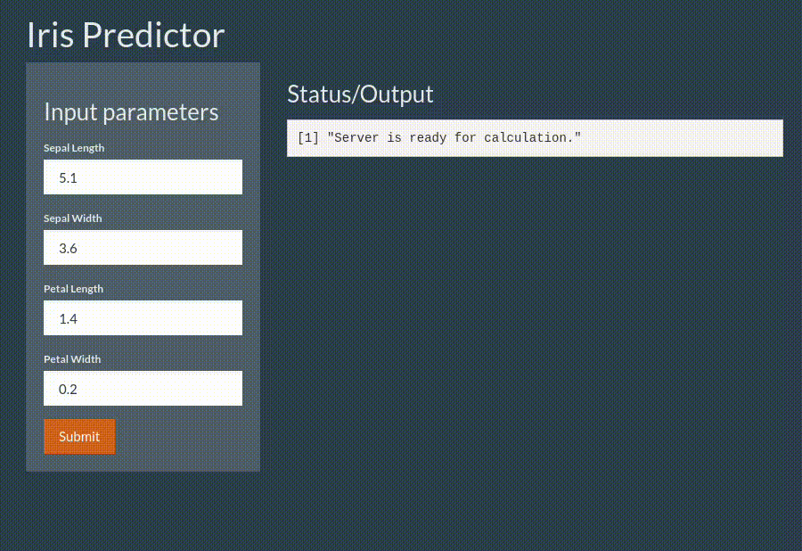

# Aplicación Shiny para la Clasificación del Conjunto de Datos Iris

Esta aplicación Shiny ha sido desarrollada para demostrar un modelo de clasificación utilizando el conocido conjunto de datos Iris. El modelo permite predecir la especie de una flor de iris basándose en las medidas de sus características: longitud y ancho del sépalo, y longitud y ancho del pétalo.

## Características de la Aplicación

- **Entrada Interactiva**: Los usuarios pueden ingresar manualmente las medidas de las características de una flor de iris para obtener predicciones en tiempo real.
- **Visualización de Resultados**: La aplicación proporciona una visualización clara de la predicción del modelo junto con las probabilidades asociadas para cada especie de iris.
- **Interfaz Amigable**: Utilizando el tema `united` de `shinythemes` para mejorar la experiencia del usuario.

## Tecnologías Utilizadas

- **R y Shiny**: Todo el backend de la aplicación está construido en R, utilizando el framework Shiny para la interactividad.
- **randomForest**: Se utiliza el paquete `randomForest` para entrenar el modelo de clasificación.
- **shinythemes**: Para mejorar la estética de la aplicación.

## Cómo Usar

1. Clone el repositorio en su máquina local.
2. Asegúrese de tener instalados R y los paquetes necesarios (`shiny`, `shinythemes`, `randomForest`).
3. Ejecute la aplicación localmente usando el comando `runApp()` en el directorio del proyecto.
4. Ingrese los valores de las características de una flor de iris para ver la predicción del modelo.

## Ejemplo de Uso

Este GIF muestra cómo interactuar con la aplicación para obtener predicciones del modelo de clasificación de Iris.

## Enlace a la Aplicación

Si la aplicación está alojada en línea (por ejemplo, en shinyapps.io), incluya aquí el enlace para acceder directamente a ella desde cualquier navegador.
